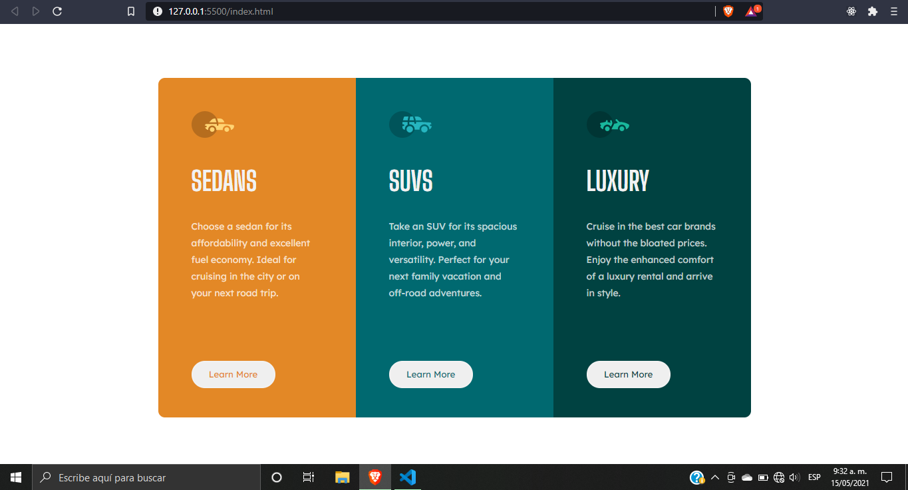

# Frontend Mentor - 3-column preview card component solution

This is a solution to the [3-column preview card component challenge on Frontend Mentor](https://www.frontendmentor.io/challenges/3column-preview-card-component-pH92eAR2-). Frontend Mentor challenges help you improve your coding skills by building realistic projects.

## Table of contents

- [Overview](#overview)
  - [Screenshot](#screenshot)
- [My process](#my-process)
  - [Built with](#built-with)
  - [What I learned](#what-i-learned)
- [Author](#author)

## Overview

### The challenge

Users should be able to:

- View the optimal layout depending on their device's screen size
- See hover states for interactive elements

### Screenshot



### Links

- Solution URL: [Componente Card de tres columnas](https://github.com/Adiazgomez68/Componente-Card-de-tres-columnas.git)

## My process

### Built with

- Semantic HTML5 markup
- CSS custom properties
- Flexbox

### What I learned

I learned how to make a web page responsive using Media Queries:

```css
@media (max-width: 375px) {
  .box {
    width: 310px;
    display: block;
    margin-top: 0%;
  }
}
```

## Author

- Frontend Mentor - [@Adiazgomez68](https://www.frontendmentor.io/profile/Adiazgomez68)
- Facebook - [Andrés Díaz](https://www.facebook.com/andresfarid.diazgomez/)
